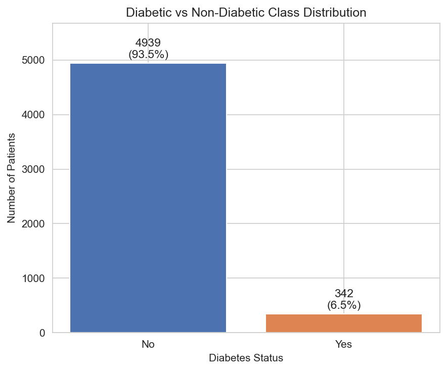
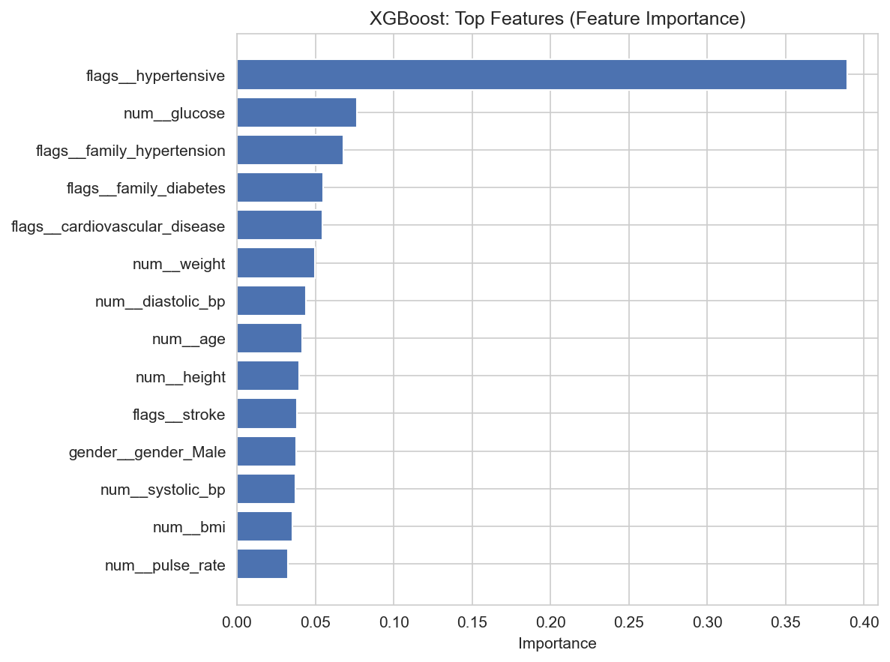

# Comparative Analysis of Machine Learning Algorithms for Diabetes Risk Prediction Using the DiaBD Bangladesh Dataset

## Abstract

Diabetes is a growing public health concern in Bangladesh, and early risk identification can help direct patients toward diagnostic testing and lifestyle intervention. This project compares four machine learning algorithms — Logistic Regression, K-Nearest Neighbors (KNN), Random Forest, and XGBoost — for binary classification of diabetes status (Diabetic / Non-Diabetic) using the DiaBD Bangladesh clinical dataset (5,288 records, 14 clinical/demographic features). The dataset exhibits severe class imbalance (6.47% diabetic). All models were evaluated with a stratified 80/20 train-test split, and compared across accuracy, precision, recall, F1-score, and ROC-AUC — with particular attention to diabetic-class recall, since accuracy alone was found to be misleading (baseline models scored 93–94% accuracy while missing 78–96% of diabetic patients). Two imbalance-handling strategies (class weighting and SMOTE) were compared against the imbalanced baseline, and all four algorithms were then tuned via 5-fold cross-validated grid/randomized search optimizing F1-score. After tuning, XGBoost achieved the best F1-score (0.388) and a strong ROC-AUC (0.856), Random Forest achieved the best ROC-AUC (0.863), and Logistic Regression achieved by far the highest recall (63.2%) at the cost of precision. `hypertensive` status and `glucose` level were consistently the strongest predictors across all interpretable models. The results show that class-imbalance handling is essential on this dataset and that model choice should depend on the intended use case (screening vs. confirmatory triage) rather than accuracy alone.

## 1. Introduction

Diabetes mellitus is a chronic metabolic condition and a major cause of morbidity worldwide. In Bangladesh, rising rates of diabetes combined with limited access to routine clinical screening make early, low-cost risk identification particularly valuable — a machine learning model trained on easily-collected clinical measurements (age, blood pressure, pulse rate, glucose, BMI, and family/medical history flags) could, in principle, help flag patients who warrant a confirmatory diagnostic test. Machine learning is well suited to this kind of screening task because it can learn non-linear relationships between multiple risk factors simultaneously, rather than relying on a single threshold (e.g. fasting glucose alone).

This project uses the **DiaBD dataset**, a Bangladesh-specific clinical dataset, which is valuable precisely because diabetes risk factors and population characteristics (body size, blood pressure norms, disease prevalence) can differ meaningfully between populations — a model trained on a Western dataset (e.g. Pima Indians Diabetes Dataset) may not transfer well to a Bangladeshi clinical population. We make no exaggerated medical claims: the models in this project are trained for a coursework comparative-analysis exercise, and their predictions are **not clinical diagnoses**.

## 2. Objective

**Main objective:** To compare the performance of Logistic Regression, KNN, Random Forest, and XGBoost for diabetes classification using the DiaBD dataset.

**Secondary objectives:**
- Investigate the effect of severe class imbalance (~94% vs ~6%) on model performance.
- Compare two imbalance-handling strategies: class weighting and SMOTE.
- Identify which clinical/demographic features are most influential in each model's predictions.
- Compare the behavior of traditional statistical (Logistic Regression, KNN) and ensemble tree-based (Random Forest, XGBoost) algorithms.

## 3. Dataset Description

**Source file:** `data/diabd.csv` (copied from the downloaded `DiaBD A Diabetes Dataset for Enhanced Risk Analysi/` folder).

- **Instances (raw):** 5,288
- **Instances (after cleaning):** 5,281 (7 rows removed; see Section 4 and 9)
- **Features:** 14 predictor columns + 1 target column
- **Target:** `diabetic` (Yes/No), mapped to 1/0 for modelling
- **Missing values:** none found in any column
- **Duplicate rows:** none found

### Feature description table

| Feature | Type | Description | Observed range (post-cleaning) |
|---|---|---|---|
| age | Numerical | Patient age (years) | 21 – 80 |
| gender | Categorical | Female / Male | Female: 3,746 (70.9%), Male: 1,535 (29.1%) |
| pulse_rate | Numerical | Resting pulse rate (bpm) | 30 – 133 (after removing 3 impossible <30 values) |
| systolic_bp | Numerical | Systolic blood pressure (mmHg) | 62 – 231 |
| diastolic_bp | Numerical | Diastolic blood pressure (mmHg) | 45 – 119 |
| glucose | Numerical | Blood glucose (mmol/L) | ~1 – 33.46 (after removing 1 impossible 0 value) |
| height | Numerical | Height (m) | ~1.0 – 1.96 (after removing 3 impossible <1.0 m values) |
| weight | Numerical | Weight (kg) | 3 – 100.7 |
| bmi | Numerical | Body Mass Index | 1.22 – 574.13 in raw data; extreme values tied to the impossible-height rows removed above |
| family_diabetes | Binary flag (0/1) | Family history of diabetes | 3.2% positive |
| hypertensive | Binary flag (0/1) | Currently hypertensive | 11.1% positive |
| family_hypertension | Binary flag (0/1) | Family history of hypertension | — |
| cardiovascular_disease | Binary flag (0/1) | History of cardiovascular disease | — |
| stroke | Binary flag (0/1) | History of stroke | — |
| **diabetic** (target) | Binary (Yes/No) | Diabetes status | No: 4,946 (93.53%), Yes: 342 (6.47%) — raw data |

### Class distribution



The dataset is severely imbalanced: only 6.47% of patients (342 of 5,288) are labeled diabetic. This imbalance is the central methodological challenge addressed throughout this project.

## 4. Methodology

```text
DiaBD Dataset
     |
Data Inspection  (shape, dtypes, missing values, duplicates, describe)
     |
Data Cleaning    (remove 7 physiologically impossible rows; documented, not silent)
     |
Exploratory Data Analysis  (distributions, class-wise comparisons, correlation, outliers)
     |
Train/Test Split  (80/20, stratified on target, random_state=42)
     |
Encoding + Scaling  (OneHotEncoder for gender; StandardScaler for LR/KNN only; fit on
                      training data only, inside sklearn Pipelines, to prevent leakage)
     |
Baseline Models  (LR, KNN, RF, XGBoost trained on the untouched imbalanced training set)
     |
Class Imbalance Handling  (class_weight="balanced" vs SMOTE, compared against baseline)
     |
Hyperparameter Tuning  (5-fold StratifiedKFold CV, GridSearchCV/RandomizedSearchCV, scoring=F1)
     |
Final Evaluation  (tuned models scored once on the untouched test set)
     |
Feature Importance  (LR coefficients, RF/XGBoost importances)
     |
Model Comparison  (trade-off discussion; best model selected on evidence, not accuracy alone)
```

Each stage is implemented as a small, testable function in `src/` (`data_preprocessing.py`, `eda.py`, `train_models.py`, `evaluate_models.py`) and orchestrated end-to-end by `main.py`.

## 5. Machine Learning Algorithms

### Logistic Regression
Models the probability that a patient is diabetic as a sigmoid (logistic) function of a weighted sum of the input features: `P(y=1|x) = 1 / (1 + e^-(w·x + b))`. The weights `w` are learned by minimizing a regularized log-loss on the training data. It is a simple, fast, and interpretable linear baseline — its coefficients directly indicate how strongly (and in which direction) each feature is associated with the predicted log-odds of diabetes.

### K-Nearest Neighbors (KNN)
A non-parametric, instance-based method. To classify a new patient, KNN finds the `k` most similar patients in the training set (by distance in feature space) and predicts the majority class among them. It makes no assumption about the underlying data distribution, but is sensitive to feature scale (hence StandardScaler is required) and, as this project demonstrates, struggles when one class is rare, since a rare class is unlikely to dominate a random patient's `k` nearest neighbors.

### Random Forest
An ensemble of many decision trees, each trained on a bootstrap-resampled subset of the training data and a random subset of features at each split. Final predictions are made by majority vote (or averaged probability) across all trees. This reduces the overfitting risk of a single decision tree and can capture non-linear feature interactions.

### XGBoost (Extreme Gradient Boosting)
An ensemble of decision trees built **sequentially**, where each new tree is trained to correct the residual errors of the trees built so far (gradient boosting). This typically yields strong predictive performance and, via `scale_pos_weight`, offers a direct mechanism to up-weight the minority (diabetic) class during training.

## 6. Evaluation Metrics

- **Accuracy** = (TP + TN) / (TP + TN + FP + FN) — overall proportion correct.
- **Precision** = TP / (TP + FP) — of patients predicted diabetic, how many actually are.
- **Recall** = TP / (TP + FN) — of patients who are actually diabetic, how many the model catches.
- **F1-score** = 2 × (Precision × Recall) / (Precision + Recall) — harmonic mean, balances the two.
- **ROC-AUC** — the probability that the model ranks a randomly chosen diabetic patient's predicted risk higher than a randomly chosen non-diabetic patient's; threshold-independent.

**Why recall and F1 matter more than accuracy here:** with only 6.47% of patients diabetic, a trivial model that predicts "non-diabetic" for every patient scores ~93.5% accuracy while catching zero true diabetic cases. In a health-screening context, a **false negative** (telling a diabetic patient they are healthy) delays diagnosis and treatment, which is generally more costly than a **false positive** (referring a healthy patient for a confirmatory test). This is why diabetic-class recall and F1-score are emphasized throughout this project rather than accuracy alone.

## 7. Exploratory Data Analysis

All figures below are generated directly by `src/eda.py` and saved in `outputs/figures/`.

**Glucose** (`glucose_distribution.png`): Median glucose is 6.85 mmol/L for non-diabetic patients vs. 9.28 mmol/L for diabetic patients — a clear, medically expected separation, confirming glucose is a meaningful and correctly-scaled predictor (units are mmol/L, not mg/dL).

**BMI** (`bmi_distribution.png`): Median BMI is 21.79 for non-diabetic vs. 23.19 for diabetic patients — diabetic patients trend slightly higher, consistent with the known association between higher BMI and type-2 diabetes risk, though the separation is much less pronounced than for glucose.

**Age** (`age_distribution.png`): Median age is 45 for non-diabetic vs. 50 for diabetic patients, consistent with diabetes risk increasing with age.

**Hypertension** (`hypertensive_vs_target.png`): This is the single strongest categorical association found in the data. Among hypertensive patients (586 of 5,281, 11.1%), 31.4% are diabetic; among non-hypertensive patients, only 3.4% are diabetic. This large gap explains why `hypertensive` emerges as the top-ranked predictor in every model (Section 11).

**Gender** (`gender_vs_target.png`): Diabetes prevalence is broadly similar between genders in this sample (6.1% of female patients, 7.4% of male patients), a much smaller effect than hypertension status.

**Family history of diabetes** (`family_diabetes_vs_target.png`): Counter-intuitively, the `family_diabetes=1` subgroup (169 patients) showed a *lower* diabetes rate (3.55%, 6 of 169) than the `family_diabetes=0` subgroup (6.57%, 336 of 5,112). Given the very small size of the `family_diabetes=1` subgroup, this is likely a sampling artifact rather than a reliable population-level relationship, and should not be over-interpreted.

**Correlation heatmap** (`correlation_heatmap.png`, numerical features only — encoded flags and identifiers excluded): The strongest correlations are `weight`–`bmi` (r = 0.84, expected since BMI is computed from weight and height) and `systolic_bp`–`diastolic_bp` (r = 0.72, expected physiologically). `glucose` shows only weak linear correlation with other numerical features (|r| < 0.16 with all others), suggesting it contributes largely independent predictive signal — consistent with its strong showing in feature importance.

**Outlier analysis** (`outlier_boxplots.png`): Boxplots of all numerical features show a number of statistical outliers (e.g. some patients with very high systolic BP or glucose). These extreme-but-plausible values (e.g. glucose up to ~30 mmol/L, which is very high but does occur in poorly-controlled diabetics) were **retained** — they are medically plausible and informative for the classification task, unlike the physiologically impossible values described in Section 9, which were removed.

## 8. Class Imbalance

- **Raw class distribution:** No = 4,946 (93.53%), Yes = 342 (6.47%).
- **After stratified 80/20 split:** training set 93.51% / 6.49%, test set 93.57% / 6.43% — near-identical to the original ratio, confirming stratification worked correctly.

**Why accuracy is misleading here:** A classifier that always predicts "non-diabetic" would score 93.5% accuracy while achieving 0% recall on the class we actually care about detecting. This is exactly the failure mode observed in the baseline KNN model, which scored 93.09% accuracy but only 4.41% diabetic-class recall (Section 10).

**Balancing approaches used:**
1. **Class weighting** — `class_weight="balanced"` for Logistic Regression and Random Forest (reweights the loss function to penalize misclassifying the minority class more heavily); `scale_pos_weight` (computed as `n_negative / n_positive` = 14.416 from the training data) for XGBoost. KNN has no equivalent parameter in scikit-learn, so it was left unweighted for this comparison (per the assignment's explicit instruction not to force an invalid approach onto KNN).
2. **SMOTE (Synthetic Minority Over-sampling Technique)** — generates synthetic minority-class (diabetic) samples by interpolating between existing minority-class neighbors. Applied **only to the training fold**, inside an `imblearn.pipeline.Pipeline`, so the test set and cross-validation validation folds are never touched by synthetic data (verified in Section 22).

## 9. Experimental Setup

- **Train/test split:** 80% / 20%, `random_state=42`, `stratify=y`.
- **Cleaning:** 7 rows removed for physiologically impossible values — glucose = 0 mmol/L (1 row, incompatible with a living patient), height < 1.0 m for an adult (3 rows: 0.36 m, 0.64 m, 0.99 m — two of these also produced BMI values of 574 and 156, confirming `bmi = weight / height²` in this dataset), and pulse_rate < 30 bpm (3 rows: values of 5, 10, and 5 bpm, incompatible with life). No duplicate rows were found. This is a targeted, documented removal of clear data-entry errors — not a blanket outlier-removal step (see Section 7 for outliers that were deliberately retained).
- **Encoding:** `gender` one-hot encoded (`drop="if_binary"`); the five already-binary flag columns (`family_diabetes`, `hypertensive`, `family_hypertension`, `cardiovascular_disease`, `stroke`) passed through unchanged.
- **Scaling:** `StandardScaler` for Logistic Regression and KNN (fit on the training fold only, inside each model's Pipeline); Random Forest and XGBoost use unscaled features, since tree-based splits are invariant to monotonic feature scaling.
- **Cross-validation:** `StratifiedKFold(n_splits=5, shuffle=True, random_state=42)` for all hyperparameter tuning.
- **Hyperparameter tuning:** `GridSearchCV` (exhaustive) for Logistic Regression and KNN, whose search spaces are small; `RandomizedSearchCV` (`n_iter=30`) for Random Forest and XGBoost, whose search spaces are larger. Scoring metric: **F1-score** on the diabetic class (justification in Section 6).
- **SMOTE:** applied only inside training folds via `imblearn.pipeline.Pipeline`, `random_state=42`.

## 10. Results

### 10.1 Baseline Model Results (no imbalance handling)

| Model | Accuracy | Precision | Recall | F1 Score | ROC-AUC |
|---|---|---|---|---|---|
| Logistic Regression | 0.9347 | 0.4762 | 0.1471 | 0.2247 | 0.8325 |
| KNN | 0.9309 | 0.2727 | 0.0441 | 0.0759 | 0.6513 |
| Random Forest | 0.9366 | 0.5333 | 0.1176 | 0.1928 | 0.8531 |
| XGBoost | 0.9328 | 0.4545 | 0.2206 | 0.2970 | 0.8672 |

*(`outputs/tables/baseline_results.csv`; confusion matrices: `outputs/figures/confusion_matrices_baseline.png`; ROC curves: `outputs/figures/roc_curves_baseline.png`)*

All four baseline models score within 1.4 points of each other on accuracy (93.1–93.7%), yet their diabetic-class recall ranges from a very poor 4.4% (KNN) to a still-modest 22.1% (XGBoost). This is the clearest demonstration in this project of why accuracy alone is an unreliable metric for imbalanced classification.

### 10.2 Balanced / SMOTE Results

| Model | Accuracy | Precision | Recall | F1 Score | ROC-AUC |
|---|---|---|---|---|---|
| Logistic Regression (Baseline) | 0.9347 | 0.4762 | 0.1471 | 0.2247 | 0.8325 |
| Logistic Regression (Class-Weighted) | 0.8486 | 0.2416 | **0.6324** | 0.3496 | 0.8293 |
| Logistic Regression (SMOTE) | 0.8543 | 0.2440 | 0.6029 | 0.3475 | 0.8299 |
| KNN (Baseline) | 0.9309 | 0.2727 | 0.0441 | 0.0759 | 0.6513 |
| KNN (Class-Weighted, n/a) | 0.9309 | 0.2727 | 0.0441 | 0.0759 | 0.6513 |
| KNN (SMOTE) | 0.8420 | 0.1847 | 0.4265 | 0.2578 | 0.7059 |
| Random Forest (Baseline) | 0.9366 | 0.5333 | 0.1176 | 0.1928 | 0.8531 |
| Random Forest (Class-Weighted) | 0.9385 | **0.6364** | 0.1029 | 0.1772 | 0.8658 |
| Random Forest (SMOTE) | 0.9309 | 0.4444 | 0.2941 | 0.3540 | 0.8326 |
| XGBoost (Baseline) | 0.9328 | 0.4545 | 0.2206 | 0.2970 | **0.8672** |
| XGBoost (Class-Weighted) | 0.9253 | 0.3962 | 0.3088 | 0.3471 | 0.8534 |
| XGBoost (SMOTE) | 0.9281 | 0.4091 | 0.2647 | 0.3214 | 0.8322 |

*(`outputs/tables/balanced_results.csv`)*

Key observations:
- **Class weighting had a dramatic effect on Logistic Regression** (recall 14.7% → 63.2%, F1 0.225 → 0.350) but almost no effect on Random Forest (recall 11.8% → 10.3%, essentially unchanged) — Random Forest's default splits were apparently already reasonably balanced-agnostic, and `class_weight="balanced"` alone was not enough to move it; the tuned Random Forest in Section 10.3 (which also searches `max_depth`, `min_samples_leaf`, etc. jointly) achieves a bigger recall improvement.
- **SMOTE improved recall for every single model**, most dramatically for KNN (4.4% → 42.6%), confirming that KNN's poor baseline recall was specifically an imbalance problem (with more synthetic minority neighbors available, KNN can now find diabetic neighbors).
- **Every imbalance-handling strategy traded accuracy for recall.** This is expected and desired: on this dataset, high accuracy is easy but uninformative, while recall gains directly reflect catching more true diabetic patients.

### 10.3 Hyperparameter Tuning (5-fold CV, scoring = F1)

| Model | Best CV F1 | Best Parameters |
|---|---|---|
| Logistic Regression | 0.3763 | `C=0.1`, `penalty='l1'`, `class_weight='balanced'` |
| KNN | 0.2921 | `n_neighbors=3`, `weights='uniform'`, `p=2` |
| Random Forest | 0.4369 | `n_estimators=200`, `max_depth=30`, `min_samples_split=2`, `min_samples_leaf=4`, `max_features='log2'`, `class_weight='balanced'` |
| XGBoost | 0.4407 | `n_estimators=100`, `max_depth=6`, `learning_rate=0.1`, `subsample=0.8`, `colsample_bytree=1.0`, `scale_pos_weight=14.42` |

*(`outputs/tables/best_hyperparameters.csv`)*

Notably, cross-validation **independently selected `class_weight="balanced"`** for both Logistic Regression and Random Forest, and the full computed `scale_pos_weight` for XGBoost — i.e., the search was free to keep these models unweighted (`class_weight=None`, `scale_pos_weight=1`) if that scored better on F1, and it did not. This is evidence, not an assumption, that imbalance-aware weighting genuinely helps on this dataset.

### 10.4 Final Comparison (Tuned Models on the Untouched Test Set)

| Model | Accuracy | Precision | Recall | F1 Score | ROC-AUC |
|---|---|---|---|---|---|
| Logistic Regression | 0.8477 | 0.2402 | **0.6324** | 0.3482 | 0.8285 |
| KNN | 0.9309 | **0.3684** | 0.1029 | 0.1609 | 0.6231 |
| Random Forest | 0.9300 | 0.4318 | 0.2794 | 0.3393 | **0.8627** |
| XGBoost | 0.9196 | 0.3803 | 0.3971 | **0.3885** | 0.8561 |

*(`outputs/tables/tuned_results.csv`, `outputs/tables/final_comparison.csv`; confusion matrices: `outputs/figures/confusion_matrices_tuned.png`; ROC curves: `outputs/figures/roc_curves.png`; bar chart: `outputs/figures/model_comparison.png`)*

**Ranking by different criteria:**
- **Highest recall (best at catching diabetic patients):** Logistic Regression (63.2%) — by a wide margin.
- **Highest precision (fewest false alarms among positive predictions):** KNN (36.8%), but at very low recall (10.3%), making it clinically weak as a screening tool despite the precision figure.
- **Highest F1-score (best precision/recall balance):** XGBoost (0.3885).
- **Highest ROC-AUC (best overall ranking ability, threshold-independent):** Random Forest (0.8627), XGBoost close behind (0.8561).
- **Simplest / fastest / most interpretable:** Logistic Regression (linear coefficients, fastest to train and predict).

No single model dominates on every metric — this is discussed further in Section 12.

## 11. Feature Importance

*(Association with model predictions — not a claim of medical causation. All values are read directly from `outputs/tables/feature_importance_*.csv`.)*

**Logistic Regression** (standardized |coefficient|, top 5): `hypertensive` (2.11), `glucose` (0.71), `bmi` (0.46), `height` (0.28), `age` (0.24).

**Random Forest** (feature importance, top 5): `glucose` (0.226), `hypertensive` (0.186), `systolic_bp` (0.111), `diastolic_bp` (0.090), `bmi` (0.088).

**XGBoost** (feature importance, top 5): `hypertensive` (0.389), `glucose` (0.076), `family_hypertension` (0.068), `family_diabetes` (0.055), `cardiovascular_disease` (0.054).



**Discussion:** `hypertensive` status and `glucose` level are consistently the two most influential features across all three models, though their relative ranking differs slightly (Random Forest ranks `glucose` first; Logistic Regression and XGBoost rank `hypertensive` first). This is directly consistent with the EDA finding in Section 7 that diabetes prevalence is roughly 9× higher among hypertensive patients (31.4%) than non-hypertensive patients (3.4%) in this dataset — a strong, medically plausible signal (hypertension and type-2 diabetes are well-documented comorbid conditions), which the models are correctly picking up as **associated with**, not necessarily causing, diabetes status.

## 12. Discussion

**Which model performed best?** There is no single "best" model independent of use case:
- If the priority is **not missing diabetic patients** (a first-pass screening tool, where a false positive only costs a follow-up test), **Logistic Regression** is the strongest choice: it catches 63.2% of diabetic patients in the test set, more than double any other tuned model, and remains the simplest and most interpretable model.
- If the priority is a **balanced trade-off** between catching diabetic patients and not overwhelming clinicians with false alarms, **XGBoost** is the strongest choice: it has the best F1-score (0.3885) and the second-best ROC-AUC (0.8561).
- If the priority is **overall ranking quality** (e.g. for triaging patients by risk score rather than a hard yes/no cutoff), **Random Forest** is the strongest choice, with the best ROC-AUC (0.8627).
- **KNN was consistently the weakest model** on every imbalance-sensitive metric (baseline recall 4.4%, tuned recall 10.3%, tuned ROC-AUC 0.623 — the lowest of any model in any configuration) — likely because it has no built-in mechanism to account for class imbalance, and its SMOTE variant, while much better (42.6% recall), still trailed the tree-based models on F1 and precision.

**Did balancing improve minority-class prediction?** Yes, clearly. Every imbalance-handling strategy (class weighting or SMOTE) improved diabetic-class recall for every model relative to its unweighted baseline (Section 10.2), at a predictable cost to precision and overall accuracy.

**Did tuning improve results?** Mixed. Tuning improved F1-score for Random Forest (0.1928 → 0.3393) and, modestly, for XGBoost's balance of precision/recall (baseline F1 0.2970 → tuned F1 0.3885) and Logistic Regression's F1 (0.2247 → 0.3482, essentially matching its class-weighted variant since CV selected `class_weight="balanced"`). However, **tuned KNN's ROC-AUC (0.6231) was actually worse than its untuned baseline ROC-AUC (0.6513)** — cross-validation selected `n_neighbors=3` to maximize F1-score on the training folds, but a small `k` is a high-variance choice, and this appears to have overfit slightly to the specific patients in the training folds rather than generalizing as well on ranking quality (ROC-AUC) on the held-out test set. This is a useful illustration that optimizing one metric (F1) does not guarantee improvement on another (ROC-AUC), and that the choice of tuning metric matters (Section 6).

**Possible signs of overfitting:** Random Forest's tuned configuration (`max_depth=30`, `min_samples_leaf=4`) allows fairly deep, expressive trees; combined with its consistently strong training-vs-test gap pattern typical of Random Forest, some overfitting to the training folds is plausible, though its test-set ROC-AUC (0.8627, the best of all models) suggests this did not meaningfully harm its actual generalization on this dataset. KNN's tuning result (discussed above) is the clearest sign of a metric-driven overfitting effect in this project.

**Do simpler models perform competitively?** Yes — Logistic Regression, the simplest model in this comparison, achieved the highest recall of any tuned model and a competitive ROC-AUC (0.8285, close to the ensemble models' ~0.85–0.86), demonstrating that the relationship between these clinical features and diabetes status is substantially, though not entirely, linear.

## 13. Limitations

- **Severe class imbalance** (6.47% diabetic) means even the best recall achieved (63.2%, Logistic Regression) still misses over a third of diabetic patients, and all models' precision remains low (24–43%), meaning a meaningful fraction of positive predictions are false alarms.
- **Single-country, single-dataset sample:** the DiaBD dataset reflects one Bangladeshi clinical population; findings (e.g. the strength of the hypertension–diabetes association) may not generalize to other populations without external validation.
- **Predictions are not clinical diagnoses.** These models are trained for a coursework comparative-analysis exercise and should not be used, as-is, for real clinical decision-making.
- **Limited feature set:** the dataset does not include some risk factors known to be relevant to diabetes (e.g. diet, physical activity level, HbA1c, waist circumference), which likely constrains achievable performance.
- **A small subgroup anomaly** was observed for `family_diabetes` (Section 7) — the `family_diabetes=1` subgroup is small (169 patients) and showed a lower-than-expected diabetes rate, which is more likely a sampling artifact than a reliable finding, and should not be treated as evidence that family history is protective.
- **Model generalizability requires external validation** on an independent dataset before any of these findings should be treated as robust beyond this specific sample and train/test split.

## 14. Conclusion

This project compared Logistic Regression, KNN, Random Forest, and XGBoost for diabetes risk classification on the DiaBD Bangladesh dataset, with a specific focus on the dataset's severe class imbalance (6.47% diabetic). Baseline models achieved misleadingly high accuracy (93–94%) while catching very few diabetic patients (4–22% recall), directly demonstrating why accuracy alone is an inappropriate metric for this task. Both class weighting and SMOTE meaningfully improved diabetic-class recall across all models, and cross-validated hyperparameter tuning (optimizing F1-score) independently confirmed that imbalance-aware weighting improves performance on this dataset. After tuning, no single algorithm dominated every metric: **XGBoost offered the best precision/recall balance (F1 = 0.388)**, **Random Forest offered the best overall ranking ability (ROC-AUC = 0.863)**, and **Logistic Regression offered by far the highest diabetic-class recall (63.2%)** at the cost of precision. `hypertensive` status and `glucose` level were the two most consistently important predictors across all interpretable models, a finding directly grounded in, and consistent with, the underlying data. The main research question — how do these four algorithms compare, and how does imbalance handling affect that comparison — is answered with clear, reproducible, data-grounded evidence: **model selection for this task should be driven by the intended screening use case (favoring recall vs. favoring precision/balance) rather than by accuracy or by picking a single "winner" algorithm.**

## 15. Future Work

- Collect a larger and/or more geographically diverse Bangladesh diabetes dataset to increase the number of positive (diabetic) cases available for training and to test generalizability across regions.
- Perform external validation on an independent dataset (e.g. a different hospital or region) before considering any deployment.
- Incorporate additional lifestyle and clinical variables (diet, physical activity, HbA1c, waist circumference) that are known diabetes risk factors but are absent from this dataset.
- Apply explainable AI techniques (e.g. SHAP values) for a more rigorous, per-patient interpretability analysis beyond global feature importance.
- If deployed as a research prototype, build a simple risk-score interface around the saved XGBoost/Random Forest pipeline (`outputs/models/`), clearly labeled as a research tool and not a diagnostic device.
- Compare against deep learning approaches (e.g. a small feed-forward neural network) if a substantially larger dataset becomes available — with only 342 positive cases in the current dataset, deep learning is not justified here and would likely overfit.

---

*All figures referenced above are saved in `outputs/figures/`; all tables are saved in `outputs/tables/`; all numbers in this report were generated by running `python main.py` on the cleaned DiaBD dataset (`random_state=42` throughout) and are reproducible by re-running that command.*
